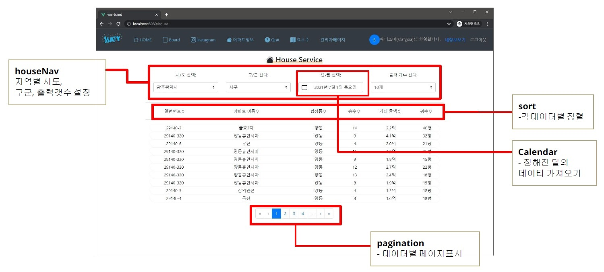
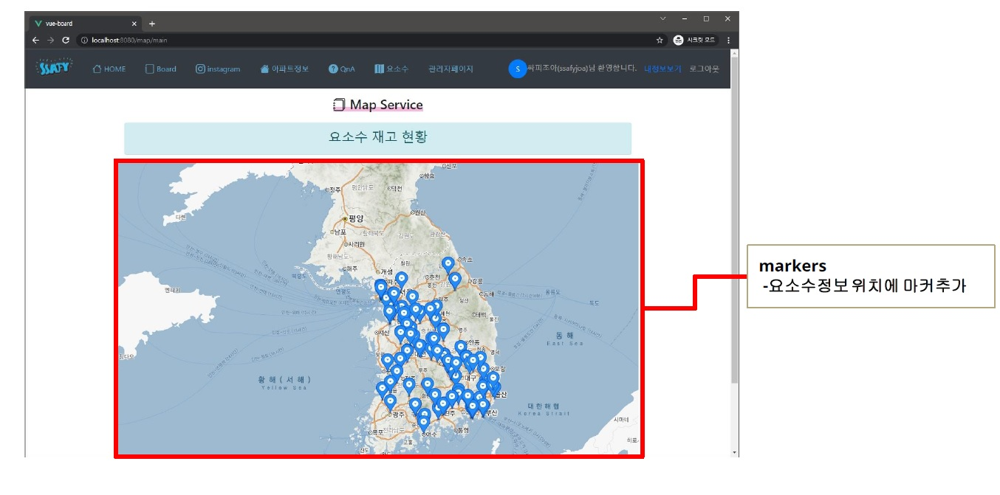

# HappyHouse-Final (Web)
### 변희성(hs), 윤설(ys) 11.18 ~ 11.24

## 목표
- 기본적인 CRUD 숙달하기
- 공공 API 사용방법 숙달하기
- FrontEnd - BackEnd 연동 숙달하기
- 가독성 있는 코드를 만들기 위한 노력 (하드코딩 피하기)

## 사용한 프레임워크
- Vue
- Spring Boot

## 실행 방법
- 소스 코드: 

      git clone https://github.com/hhssung/happyhouse.git

## 담당 역할
- QnA 게시판 CRUD 완성
- 아파트 검색 페이지 완성 (클릭시 상세 정보 창 출력)

   

- 요소수 재고 현황 조회 페이지 완성 (마커 표시, 클릭시 상세 정보 창 출력)

   

## 진행 과정
### 1118
- Front-End
  + ys: 답변완료 게시글표시 완료
  + ys: 비밀게시글 표시 완료
  + ys: 비밀게시글 설정 완료
- Back-End
  + hs: QnA 답변 작성
  + hs: QnA 비밀게시글 여부 받아오기

### 1119
- Front-End
  + ys, hs: modal 사용하여 pop-up 형식으로 상세 정보 띄우게 변경.
  + ys: 회원가입페이지폼 생성 완료
  + ys: 회원가입 기능 구현 완료
  + hs: 공공 API 관련 코드 삭제
  + hs: 아파트 출력 개수 선택할수 있게 변경.
  + hs: pageNav, listNav 추가 (기능구현은 x)
- Back-End
  + ys: 회원가입 join 기능 추가
  + hs: CORS 문제 해결. (공공 API - back단에서 처리하도록 변경)
  + hs: Hard-Coding 제거. 상수만 모아놓은 클래스 따로 만듦 (Constants.java)
  + hs: qna의 Answer 부분 update 기능 추가 

### 1122
- Front-End
  + ys: 관리자 페이지 QnA 답변기능 구현(모달창 사용)
  + ys: 관리자/회원관리 페이지 폼 완료
  + hs: pageNav, listNav 기능 구현 완료
  + hs: API 중복 호출되는 버그 수정(최적화)
- Back-End
  + hs: 공공API 부분 년/월도 받을 수 있도록 수정

### 1123
- Front-End
  + ys: 회원가입 아이디 확인 기능
  + ys: 아파트 정보 폼 애니메이션 + 디자인 추가
  + ys: navibar 아이콘 수정
  + hs : 아파트 정보 평수 추가, 디자인 추가
  + hs : 아파트 정보 정렬 기능 추가
- Back-End
  + ys : DB foreign key 재설정 (회원삭제기능시 필요)
  + ys : 회원가입 기능 구현
  + ys : 회원가입시 아이디 확인 기능 구현
  + hs : 아파트 면적 return하게 추가

### 1124
- Front-End
  + ys : 회원가입 기능 완료
  + hs : 요소수 지도 추가 (marker 표시, 상세설명 이벤트 추가)
- Back-End
  + hs : 요소수 정보 받아오는 API 추가
